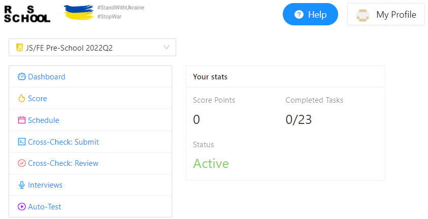

# **Nikita Krivosheev**
***Industrial engineer***

---

## **Contacts for communication**
* **Phone**  +79172073561
* **E-mail**  kr.nikita97@gmail.com
* **Telegram**  https://t.me/outcasty
* **Skype**  live:.cid.97e96b23f5e43f4a

---

## **About Myself**
 I am 24 years old, I live in Saratov Mountain. I started my career as a process engineer at Torex, where I still work.
    Over time, I decided to change my profession. My eyes fell on the IT sphere, I decided to start by studying the profession of a Front-end Developer.
       I believe that thanks to the courses from RS School, I will achieve my purpose. 

---

## **Education**
  * **University:** *Saratov State Technical University named after Y.A Gagarin (SSTU)*
  **Training program** *Design and technological support for mechanical engineering industries. Bachelor* 
  **Year** *2015-2019*

  * **University:** *Saratov State Technical University named after Y.A Gagarin (SSTU)*
  **Training program** *Design and technological support for mechanical engineering industries. Professional retraining*
  **Year** *2022-2024*

---

## **Skills**
 * **C#**  -- *First level*
 * **HTML, CSS** -- *Average level*
 * **JavaScript** -- *Average level*
 * **Git, GitHub** -- *First level*
 * **VSCode** -- *Average level*

---

## **Code Example**
*This code does not execute properly. Try to figure out why.*
``function multiply(a, b){``
  ``a  b``
``}``
**Example Solution**
``function multiply(a, b){``
  ``return a * b``
``}``

---
 
## **Courses**

---
 
## **Languages**
* **Russian** -- *Native*
* **English** -- *A1 (Beginner).*  I try to pump with the help of different applications and courses.